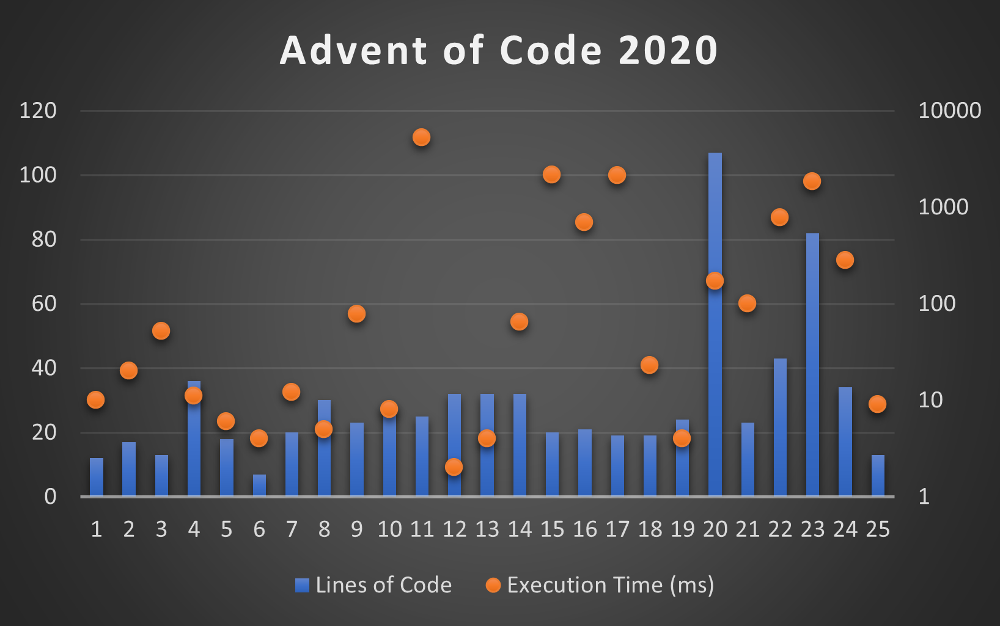

# Advent of Code 2020

  - [Day 1: Report Repair](#day-1-report-repair)
  - [Day 2: Password Philosophy](#day-2-password-philosophy)
  - [Day 3: Toboggan Trajectory](#day-3-toboggan-trajectory)
  - [Day 4: Passport Processing](#day-4-passport-processing)
  - [Day 5: Binary Boarding](#day-5-binary-boarding)
  - [Day 6: Custom Customs](#day-6-custom-customs)
  - [Day 7: Handy Haversacks](#day-7-handy-haversacks)
  - [Day 8: Handheld Halting](#day-8-handheld-halting)
  - [Day 9: Encoding Error](#day-9-encoding-error)
  - [Day 10: Adapter Array](#day-10-adapter-array)
  - [Day 11: Seating System](#day-11-seating-system)
  - [Day 12: Rain Risk](#day-12-rain-risk)
  - [Day 13: Shuttle Search](#day-13-shuttle-search)
  - [Day 14: Docking Data](#day-14-docking-data)
  - [Day 15: Rambunctious Recitation](#day-15-rambunctious-recitation)
  - [Day 16: Ticket Translation](#day-16-ticket-translation)
  - [Day 17: Conway Cubes](#day-17-conway-cubes)
  - [Day 18: Operation Order](#day-18-operation-order)
  - [Day 19: Monster Messages](#day-19-monster-messages)
  - [Day 20: Jurassic Jigsaw](#day-20-jurassic-jigsaw)
  - [Day 21: Allergen Assessment](#day-21-allergen-assessment)
  - [Day 22: Crab Combat](#day-22-crab-combat)
  - [Day 23: Crab Cups](#day-23-crab-cups)
  - [Day 24: Lobby Layout](#day-24-lobby-layout)
  - [Day 25: Combo Breaker](#day-25-combo-breaker)

## [Day 1: Report Repair](https://adventofcode.com/2020/day/1)
[[12 LoC / 5ms / 5ms](Day01.cs)] If/when I write notes for the puzzles, they will appear here!

## [Day 2: Password Philosophy](https://adventofcode.com/2020/day/2)
[[17 LoC / 19ms / 1ms](Day02.cs)]

## [Day 3: Toboggan Trajectory](https://adventofcode.com/2020/day/3)
[[13 LoC / 45ms / 7ms](Day03.cs)]

## [Day 4: Passport Processing](https://adventofcode.com/2020/day/4)
[[36 LoC / 4ms / 7ms](Day04.cs)]

## [Day 5: Binary Boarding](https://adventofcode.com/2020/day/5)
[[18 LoC / 4ms / 2ms](Day05.cs)]

## [Day 6: Custom Customs](https://adventofcode.com/2020/day/6)
[[7 LoC / 3ms / 1ms](Day06.cs)]

## [Day 7: Handy Haversacks](https://adventofcode.com/2020/day/7)
[[20 LoC / 7ms / 5ms](Day07.cs)]

## [Day 8: Handheld Halting](https://adventofcode.com/2020/day/8)
[[30 LoC / 3ms / 2ms](Day08.cs)]

## [Day 9: Encoding Error](https://adventofcode.com/2020/day/9)
[[23 LoC / 6ms / 72ms](Day09.cs)]

## [Day 10: Adapter Array](https://adventofcode.com/2020/day/10)
[[28 LoC / 7ms / 1ms](Day10.cs)]

## [Day 11: Seating System](https://adventofcode.com/2020/day/11)
[[25 LoC / 2484ms / 2791ms](Day11.cs)]

## [Day 12: Rain Risk](https://adventofcode.com/2020/day/12)
[[32 LoC / 1ms / 1ms](Day12.cs)]

## [Day 13: Shuttle Search](https://adventofcode.com/2020/day/13)
[[32 LoC / 2ms / 2ms](Day13.cs)]

## [Day 14: Docking Data](https://adventofcode.com/2020/day/14)
[[32 LoC / 8ms / 57ms](Day14.cs)]

## [Day 15: Rambunctious Recitation](https://adventofcode.com/2020/day/15)
[[20 LoC / 1ms / 2161ms](Day15.cs)]

## [Day 16: Ticket Translation](https://adventofcode.com/2020/day/16)
[[21 LoC / 12ms / 681ms](Day16.cs)]

## [Day 17: Conway Cubes](https://adventofcode.com/2020/day/17)
[[19 LoC / 89ms / 2055ms](Day17.cs)]

## [Day 18: Operation Order](https://adventofcode.com/2020/day/18)
[[19 LoC / 11ms / 12ms](Day18.cs)]

## [Day 19: Monster Messages](https://adventofcode.com/2020/day/19)
[[24 LoC / 1ms / 3ms](Day19.cs)]

## [Day 20: Jurassic Jigsaw](https://adventofcode.com/2020/day/20)
[[107 LoC / 37ms / 134ms](Day20.cs)]

## [Day 21: Allergen Assessment](https://adventofcode.com/2020/day/21)
[[23 LoC / 92ms / 8ms](Day21.cs)]

## [Day 22: Crab Combat](https://adventofcode.com/2020/day/22)
[[43 LoC / 3ms / 780ms](Day22.cs)]

## [Day 23: Crab Cups](https://adventofcode.com/2020/day/23)
[[82 LoC / 1ms / 1845ms](Day23.cs)]

## [Day 24: Lobby Layout](https://adventofcode.com/2020/day/24)
[[34 LoC / 6ms / 274ms](Day24.cs)]

## [Day 25: Combo Breaker](https://adventofcode.com/2020/day/25)
[[13 LoC / 9ms](Day25.cs)]