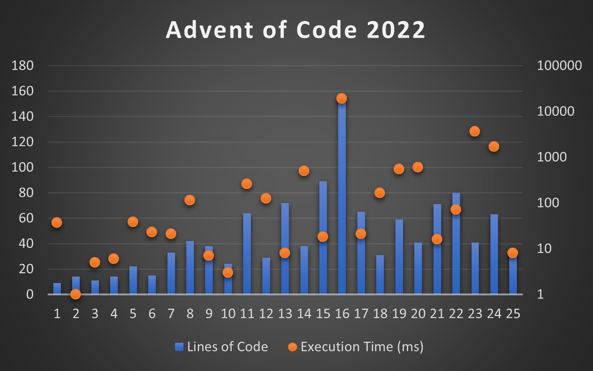

# Advent of Code 2022

  - [Day 1: Calorie Counting](#day-1-calorie-counting)
  - [Day 2: Rock Paper Scissors](#day-2-rock-paper-scissors)
  - [Day 3: Rucksack Reorganization](#day-3-rucksack-reorganization)
  - [Day 4: Camp Cleanup](#day-4-camp-cleanup)
  - [Day 5: Supply Stacks](#day-5-supply-stacks)
  - [Day 6: Tuning Trouble](#day-6-tuning-trouble)
  - [Day 7: No Space Left On Device](#day-7-no-space-left-on-device)
  - [Day 8: Treetop Tree House](#day-8-treetop-tree-house)
  - [Day 9: Rope Bridge](#day-9-rope-bridge)
  - [Day 10: Cathode-Ray Tube](#day-10-cathode-ray-tube)
  - [Day 11: Monkey in the Middle](#day-11-monkey-in-the-middle)
  - [Day 12: Hill Climbing Algorithm](#day-12-hill-climbing-algorithm)
  - [Day 13: Distress Signal](#day-13-distress-signal)
  - [Day 14: Regolith Reservoir](#day-14-regolith-reservoir)
  - [Day 15: Beacon Exclusion Zone](#day-15-beacon-exclusion-zone)
  - [Day 16: Proboscidea Volcanium](#day-16-proboscidea-volcanium)
  - [Day 17: Pyroclastic Flow](#day-17-pyroclastic-flow)
  - [Day 18: Boiling Boulders](#day-18-boiling-boulders)
  - [Day 19: Not Enough Minerals](#day-19-not-enough-minerals)
  - [Day 20: Grove Positioning System](#day-20-grove-positioning-system)
  - [Day 21: Monkey Math](#day-21-monkey-math)
  - [Day 22: Monkey Map](#day-22-monkey-map)
  - [Day 23: Unstable Diffusion](#day-23-unstable-diffusion)
  - [Day 24: Blizzard Basin](#day-24-blizzard-basin)
  - [Day 25: Full of Hot Air](#day-25-full-of-hot-air)

## [Day 1: Calorie Counting](https://adventofcode.com/2022/day/1)
[[9 LOC / 33ms / 4ms](Day01.cs)] If/when I write notes for the puzzles, they will appear here!

## [Day 2: Rock Paper Scissors](https://adventofcode.com/2022/day/2)
[[14 LOC / 1ms / 1ms](Day02.cs)]

## [Day 3: Rucksack Reorganization](https://adventofcode.com/2022/day/3)
[[11 LOC / 4ms / 1ms](Day03.cs)]

## [Day 4: Camp Cleanup](https://adventofcode.com/2022/day/4)
[[14 LOC /31ms / 3ms](Day04.cs)]

## [Day 5: Supply Stacks](https://adventofcode.com/2022/day/5)
[[22 LOC / 36ms / 2ms](Day05.cs)]

## [Day 6: Tuning Trouble](https://adventofcode.com/2022/day/6)
[[15 LOC / 3ms / 20ms](Day06.cs)]

## [Day 7: No Space Left On Device](https://adventofcode.com/2022/day/7)
[[33 LOC / 5ms / 16ms](Day07.cs)]

## [Day 8: Treetop Tree House](https://adventofcode.com/2022/day/8)
[[42 LOC / 37ms / 77ms](Day08.cs)]

## [Day 9: Rope Bridge](https://adventofcode.com/2022/day/9)
[[38 LOC / 6ms / 1ms](Day09.cs)]

## [Day 10: Cathode-Ray Tube](https://adventofcode.com/2022/day/10)
[[24 LOC / 1ms / 2ms](Day10.cs)]

## [Day 11: Monkey in the Middle](https://adventofcode.com/2022/day/11)
[[64 LOC / 18ms / 239ms](Day11.cs)]

## [Day 12: Hill Climbing Algorithm](https://adventofcode.com/2022/day/12)
[[29 LOC / 66ms / 60ms](Day12.cs)]

## [Day 13: Distress Signal](https://adventofcode.com/2022/day/13)
[[72 LOC / 5ms / 3ms](Day13.cs)]

## [Day 14: Regolith Reservoir](https://adventofcode.com/2022/day/14)
[[38 LOC / 24ms / 475ms](Day14.cs)]

## [Day 15: Beacon Exclusion Zone](https://adventofcode.com/2022/day/15)
[[89 LOC / 5ms / 13ms](Day15.cs)]

## [Day 16: Proboscidea Volcanium](https://adventofcode.com/2022/day/16)
[[156 LOC / 1164ms / 17759ms](Day16.cs)]

## [Day 17: Pyroclastic Flow](https://adventofcode.com/2022/day/17)
[[65 LOC / 13ms / 8ms](Day17.cs)]

## [Day 18: Boiling Boulders](https://adventofcode.com/2022/day/18)
[[31 LOC / 36ms / 128ms](Day18.cs)]

## [Day 19: Not Enough Minerals](https://adventofcode.com/2022/day/19)
[[59 LOC / 512ms / 39ms](Day19.cs)]

## [Day 20: Grove Positioning System](https://adventofcode.com/2022/day/20)
[[41 LOC / 60ms / 541ms](Day20.cs)]

## [Day 21: Monkey Math](https://adventofcode.com/2022/day/21)
[[71 LOC / 6ms / 10ms](Day21.cs)]

## [Day 22: Monkey Map](https://adventofcode.com/2022/day/22)
[[80 LOC / 36ms / 35ms](Day22.cs)]

## [Day 23: Unstable Diffusion](https://adventofcode.com/2022/day/23)
[[41 LOC / 70ms / 3585ms](Day23.cs)]

## [Day 24: Blizzard Basin](https://adventofcode.com/2022/day/24)
[[63 LOC / 525ms / 1153ms](Day24.cs)]

## [Day 25: Full of Hot Air](https://adventofcode.com/2022/day/25)
[[33 LOC / 8ms](Day25.cs)]
